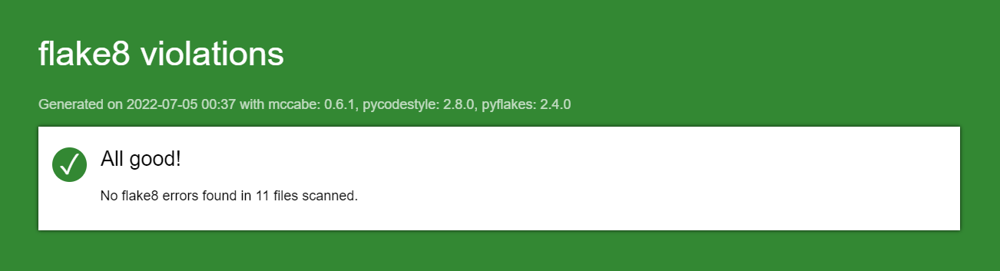

# Projet 4 DA-Python OC
***Livrable : application de gestion de tournoi d'échecs avec base de données TinyDB.***

Testé sous Windows 11 - Python version 3.10.5

## Sommaire

**[1. Installation du projet](#heading--1)**
  * [1.1. Windows](#heading--1-1)
  * [1.2. MacOS et Linux](#heading--1-2)
   
**[2. Rapport flake8](#heading--2)**
  * [2.1 Dernier rapport flake8 généré](#heading--2-1)
  * [2.2 Générer un nouveau rapport](#heading--2-2)

**[3. Fonctionnement applicatif](#heading--3)**
  * [3.1 Règles](#heading--3-1)
  * [3.2 Utilisation](#heading--3-2)
      
       

### 1. Installation du projet

#### 1.1 Windows :
   Depuis votre terminal, naviguez vers le dossier racine souhaité.

###### Récupération du projet
   Tapez :    

       git clone https://github.com/Cyl94700/P4_Op_Cl.git

###### Accéder au dossier du projet, créer et activer l'environnement virtuel
   Tapez :

       cd P4_Op_Cl
       python -m venv env 
       ~env\scripts\activate
    
###### Installer les paquets requis
   Tapez :

       pip install -r requirements.txt

###### Lancer le programme
   Tapez :

      python main.py

---------

####  1.2 MacOS et Linux :
   Depuis votre terminal, naviguez vers le dossier souhaité.

###### Récupération du projet
   Tapez :

       git clone https://github.com/Cyl94700/P4_Op_Cl.git

###### Activer l'environnement virtuel
   Tapez :

       cd P4_Op_Cl
       python -m venv env 
       source env/bin/activate
    
###### Installer les paquets requis
   Tapez :

       pip install -r requirements.txt

###### Lancer le programme
   Tapez :

       python3 main.py

----------

### 2. Rapport flake8

#### 2.1 Dernier rapport flake8 généré

#### 2.2 Générer un nouveau rapport
   Supprimez le dossier "flake8_report" contenant le dernier rapport (fichier "index.html")

   Depuis votre terminal tapez :

       flake8 --format=html --htmldir=flake8_report

Le dossier "flake8_report" est de nouveau généré avec le rapport   ("index.html") à l'intérieur.

### 3. Fonctionnement de l'application

#### 3.1 Règles

- Méthode d'appariement: *système suisse* 
- Nombre de rounds: *4*  
- Nombre de matches: *4*  
- Nombre de joueurs: *8*  
- Assignement des matches au premier round: *par rang*  
- Assignement des matches (rounds 2 à 4): *par classement*
- Attribution des points par match pour le classement:

   - *Gagnant: 1 point*  
   - *Perdant: 0 point*
   - *Match nul: 0,5 point par joueur*

#### 3.2 Utilisation
Le programme permet de gérer des tournois d'échecs.  
Le menu principal est divisé en 5 options :
###### 1) Créer un tournoi
- Vous définissez un tournoi par son nom, son lieu, un descriptif et son contrôle du temps de jeu (Blitz, Bullet ou Rapid). Ensuite, vous devez selctionner 8 joueurs associés à ce tournoi. Dès lors vous êtes invité à sauvegarder votre saisie. Après une réponse affirmative, vous pouvez commencer le tournoi si vous le souhaitez ou le faire plus tard depuis l'option 2.
- Si un joueur n'est pas présent dans la liste proposée, vous pouvez le créer depuis l'option 3.
- Lorsqu'un round est terminé, vous devez saisir les résultats de chacun des 4 matches.
- A la fin de chaque round, le classement est présenté en même temps que les matches du round suivant. Après le dernier round, vous pouvez modifier le classement par rang des joueurs.
- Pour l'appariement des matches du premier round, le système classe les 8 joueurs selon leur rang puis fait jouer le premier contre le cinquième, le deuxième contre le sixième et ainsi de suite...
- Concernant l'attribution des matches par classement (rounds 2 à 4), si un joueur 1 a déja rencontré un joueur 2, le système attribuera le premier joueur suivant au classement par point pour le joueur 1.
###### 2) Charger un tournoi
Cette option permet d'accéder à un tournoi depuis la base de données.
- Si le tournoi n'a pas encore débuté, vous y accédez à partir de la liste des matches du premier round et vous pouvez continuer le tournoi. 
- Si le tournoi est entamé, vous pouvez le poursuivre à partir de là où vous vous êtes arrêté.
- Si le tournoi est terminé, vous accédez à son classement final. Vous pouvez modifier le classement par rang des joueurs.
###### 3) Créer des joueurs
Vous avez la possibilité de créer un joueur en définissant :  
  - son nom
  - son prénom
  - sa date de naissance
  - son genre 
  - son rang
  
###### 4) Modifier un joueur
Vous avez la possibilité de modifier les 5 informations précédentes d'un joueur.
###### 5) Rapports
1. Consultation de la liste des joueurs enregistrés en base en les triant :
      - par nom
      - par rang
2. Consultation de la liste des joueurs d'un tournoi enregistrés en base en les triant :
      - par nom
      - par rang
3. Consultation de la liste des tournois
4. Consultation de la liste des rounds d'un tournoi
5. Consulation de la liste des matches d'un tournoi
